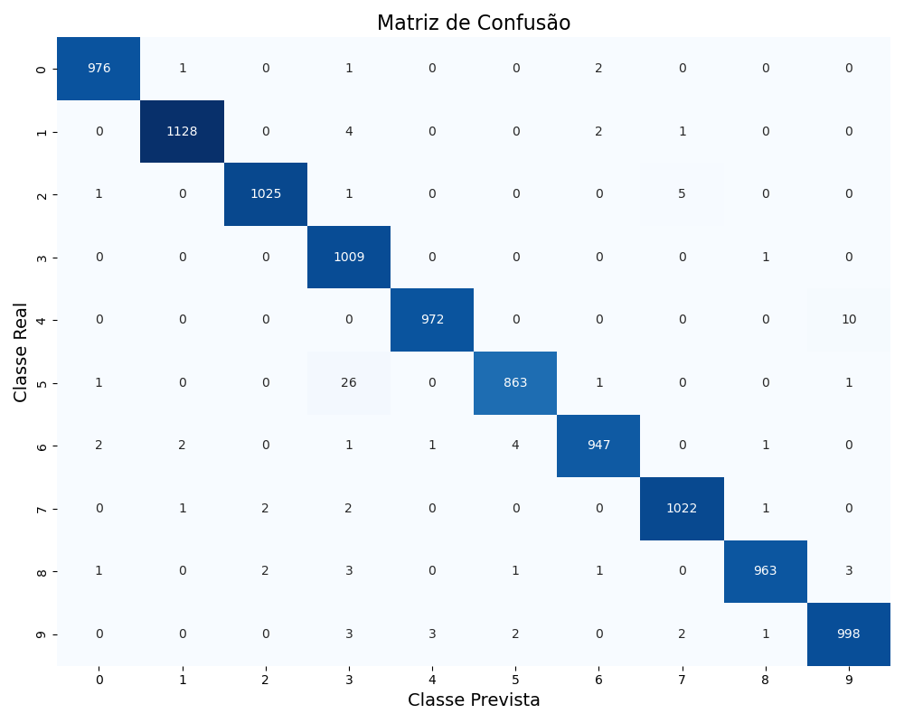

# Table of Contents

- [Introduction](#introduction)
- [Datasets Used](#datasets-used)
- [Libraries Used](#libraries-used)
- [Installation](#installation)
- [Code Explanation](#code-explanation)
- [Authors](#authors)

---

## Introduction

COMPLETAR

---

## Datasets Used

COMPLETAR

---

## Libraries Used

COMPLETAR

---

## Instalation

COMPLETAR

---

# Code Explanation

## Task 1: Digit Classification (MNIST)

### Objective
The goal of this task is to develop and train a **Convolutional Neural Network (CNN)** capable of classifying handwritten digits (0–9) from the **MNIST dataset**.  
This model serves as the **backbone** for subsequent object detection tasks.

---

### Deliverables
- `main_classification.py` – training and evaluation pipeline  
- `model.py` – CNN architecture definition  

---

#### 1. Network Architecture (`ModelBetterCNN`)
The model utilizes a deeper CNN architecture enhanced with **Batch Normalization** to accelerate convergence and stabilize training. The data flow is structured into three convolutional blocks followed by a classification head:

* **Feature Extraction Blocks:**
    * **Block 1:**
        * `Conv2d`: 32 filters, 3x3 kernel, Padding=1.
        * `BatchNorm2d`: Normalizes outputs for stability.
        * `ReLU` & `MaxPooling` (2x2). **Output:** 32x14x14.
    * **Block 2:**
        * `Conv2d`: 64 filters, 3x3 kernel, Padding=1.
        * `BatchNorm2d`: Normalizes outputs.
        * `ReLU` & `MaxPooling` (2x2). **Output:** 64x7x7.
    * **Block 3:**
        * `Conv2d`: 128 filters, 3x3 kernel, Padding=1.
        * `BatchNorm2d`: Normalizes outputs.
        * `ReLU` (No pooling is applied here to preserve spatial density). **Output:** 128x7x7.

* **Classification Head:**
    * **Flatten:** Converts the 3D feature maps (128x7x7) into a 1D vector (6,272 units).
    * **Fully Connected 1:** Linear layer with **256 neurons** and ReLU activation.
    * **Dropout:** **50% probability** (p=0.5) to aggressively prevent overfitting.
    * **Output Layer:** Linear layer producing 10 logits (classes 0-9).

#### 2. Training Configuration
* **Optimizer:** `[SGD or Adam - Check your terminal output]`
* **Loss Function:** CrossEntropyLoss
* **Learning Rate:** `[INSERT LR]`
* **Epochs:** 10
* **Batch Size:** 64

---

### Quantitative Results

The model was evaluated on the **10,000-image MNIST test set**.  
Detailed per-class performance is shown below:

| Class | Precision | Recall | F1-Score | Support |
| :---: | :---: | :---: | :---: | :---: |
| **0** | 0.9909 | 0.9969 | 0.9939 | 980 |
| **1** | 0.9878 | 0.9956 | 0.9917 | 1135 |
| **2** | 0.9980 | 0.9874 | 0.9927 | 1032 |
| **3** | 0.9892 | 0.9960 | 0.9926 | 1010 |
| **4** | 0.9949 | 0.9898 | 0.9923 | 982 |
| **5** | 0.9955 | 0.9877 | 0.9916 | 892 |
| **6** | 0.9927 | 0.9927 | 0.9927 | 958 |
| **7** | 0.9874 | 0.9942 | 0.9908 | 1028 |
| **8** | 0.9928 | 0.9949 | 0.9938 | 974 |
| **9** | 0.9900 | 0.9822 | 0.9861 | 1009 |
| **AVG** | **0.9918** | **0.9918** | **0.9918** | **10000** |

**Global Accuracy:** **99.18%**

---

### Visual Evaluation — Confusion Matrix

The confusion matrix highlights the model’s strong classification performance.  

  

  <em>Figure 1 – Confusion matrix of the CNN model on the MNIST test set.</em>

---
