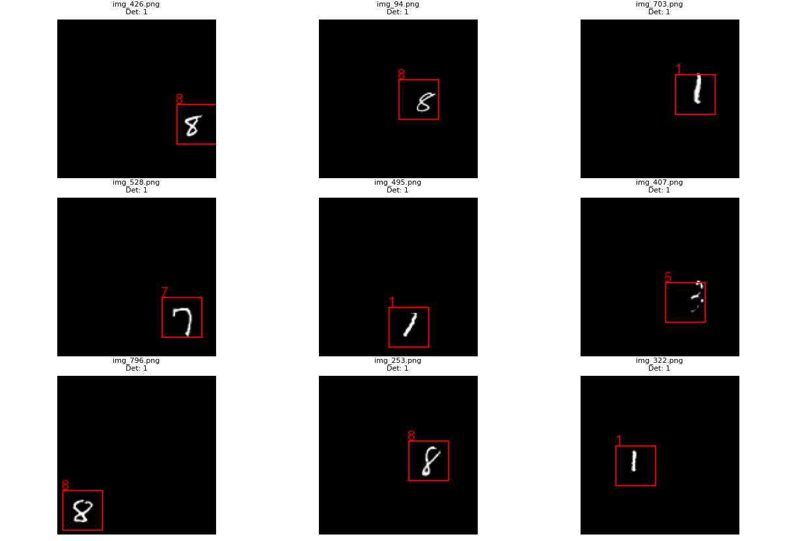
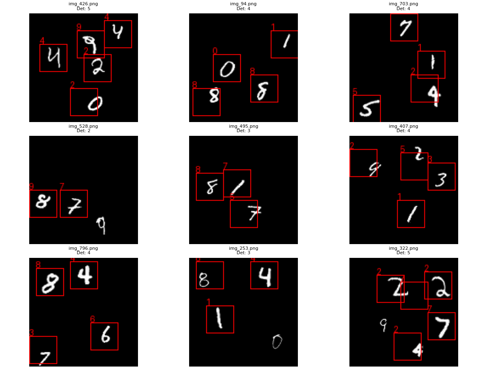
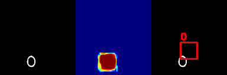
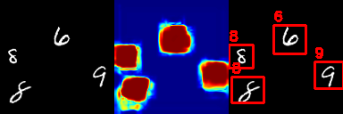

# Table of Contents

- [Introduction](#introduction)
- [Datasets Used](#datasets-used)
- [Libraries Used](#libraries-used)
- [Installation](#installation)
- [Code Explanation](#code-explanation)
- [Authors](#authors)

---

## Introduction

This project marks a transition from **classical computer vision techniques** to the domain of **Deep Learning**. While previous work focused on geometry-based methods and image registration, this assignment aims to bridge the gap between **simple image classification** and **complex object detection**.

Using the **PyTorch** framework, the project evolves incrementally through **four main stages**. It begins with the design and optimization of a **Convolutional Neural Network (CNN)** to achieve high classification accuracy on the standard **MNIST dataset**. Subsequently, the task escalates to a more realistic object detection scenario by generating a **synthetic dataset of scenes** containing multiple, randomly scattered handwritten digits.

Finally, two distinct detection strategies are explored and compared:
- A **naive Sliding Window** approach  
- An **Advanced Detector (FNC)** based on an integrated deep learning architecture  

The comparison focuses on the trade-offs between **computational efficiency**, **detection accuracy**, and **overall robustness**, highlighting the strengths and limitations of each method.


---

## Datasets

This project utilizes two main categories of data: the standard MNIST dataset for basic classification and a custom-generated synthetic dataset for object detection tasks.

### 1. Standard MNIST (Task 1)
Used for training and validating the baseline CNN classifier.
* **Source:** Automatically downloaded via `torchvision.datasets`.
* **Train Set:** 60,000 images.
* **Test Set:** 10,000 images.
* **Dimensions:** $28 \times 28$ pixels (Grayscale).
* **Content:** Single, centered handwritten digits (0-9).

### 2. Synthetic "Scenes" Dataset (Tasks 2, 3 & 4)
To simulate a realistic object detection scenario, we developed a generation script that places MNIST digits onto a larger canvas. This dataset introduces challenges such as spatial translation, multiple objects, and scale variations.

* **Resolution:** Images generated at $128 \times 128$ pixels.
* **Constraints:** * Digits are strictly non-overlapping.
    * Scale varies between $22 \times 22$ and $36 \times 36$ pixels.
* **Ground Truth:** Stores class labels and bounding boxes $(x, y, w, h)$ for each digit.

#### Dataset Versions
We generated two of the following four distinct versions to incrementally test the model's robustness:

| Version | Description | Digits per Image | Scale Variation | Purpose |
| :--- | :--- | :---: | :---: | :--- |
| **Ver. A** | Single Random | 1 | No | Testing translation invariance. |
| **Ver. B** | Single Scaled | 1 | Yes | Testing scale invariance. |
| **Ver. C** | Multi-Digit | 3 - 5 | No | Basic multiple object detection. |
| **Ver. D** | Multi-Digit Scaled | 3 - 5 | Yes | **Full complexity scenario** (Task 4 target). |

For this project, we focused on generating Version A and Version D. Version A was utilized to validate the generation pipeline and ground truth logic, while Version D was selected to challenge the model with maximum complexity.

#### Statistics & Visualization
* **Total Generated Images:** 5,000 (Train) / 1,000 (Test).
* **Class Balance:** The generator ensures a uniform distribution of digits 0-9.

---

## Setup & Requirements

This project is built using **Python** and relies on the following libraries for training, evaluation, and data generation.

### Libraries Used

* **PyTorch (`torch`, `torchvision`):** The core deep learning framework used to build the CNN architectures, manage tensors, compute gradients, and load the baseline MNIST dataset.
* **Scikit-Learn (`sklearn`):** Essential for **Task 1**, used to calculate advanced evaluation metrics not natively available in PyTorch (Precision, Recall, and F1-Score).
* **Seaborn:** Used to render the **Confusion Matrix** heatmap, allowing for a clearer visual analysis of the model's classification errors.
* **Matplotlib:** Used for visualizing training performance (Loss/Accuracy curves) and drawing bounding boxes on the synthetic images for **Tasks 2 and 3**.
* **TQDM:** A utility library that provides real-time progress bars for training loops and dataset generation.
* **NumPy:** The fundamental package for numerical array manipulation, acting as a bridge between PyTorch tensors and visualization libraries.

## Installation

To run this project locally, follow these steps.

1.  **Clone the Repository**

    ```bash
    git clone [https://github.com/morais-07/savi-2025-2026-trabalho2-grupoX.git](https://github.com/morais-07/savi-2025-2026-trabalho2-grupoX.git)
    cd savi-2025-2026-trabalho2-grupoX
    ```

2.  **Install Dependencies**

    You can install the required libraries directly with `pip`.

    ```bash
    pip install torch torchvision scikit-learn tqdm seaborn matplotlib numpy
    ```

3.  **Run the Scripts**

    Ensure the dataset folder is properly generated or configured before running Tasks 2, 3, and 4.

    ```bash
    # To run Task 1 (Optimized CNN Classifier)
    python3 main_classification.py
    
    # To run Task 2 (Dataset Generation & Stats)
    python3 main_dataset_stats.py
    
    # To run Task 3 (Sliding Window Detection)
    python3 main_sliding_window.py
    
    # To run Task 4 (Integrated Object Detector)
    python3 main_improved_detection.py
    ```
---

# Code Explanation

## Task 1: Digit Classification (MNIST)

### Objective
The goal of this task is to develop and train a **Convolutional Neural Network (CNN)** capable of classifying handwritten digits (0–9) from the **MNIST dataset**.  
This model serves as the **backbone** for subsequent object detection tasks.

---

### Deliverables
- `main_classification.py` – training and evaluation pipeline  
- `model.py` – CNN architecture definition  

---

#### 1. Network Architecture (`ModelBetterCNN`)
The model utilizes a deeper CNN architecture enhanced with **Batch Normalization** to accelerate convergence and stabilize training. The data flow is structured into three convolutional blocks followed by a classification head:

* **Feature Extraction Blocks:**
    * **Block 1:**
        * `Conv2d`: 32 filters, 3x3 kernel, Padding=1.
        * `BatchNorm2d`: Normalizes outputs for stability.
        * `ReLU` & `MaxPooling` (2x2). **Output:** 32x14x14.
    * **Block 2:**
        * `Conv2d`: 64 filters, 3x3 kernel, Padding=1.
        * `BatchNorm2d`: Normalizes outputs.
        * `ReLU` & `MaxPooling` (2x2). **Output:** 64x7x7.
    * **Block 3:**
        * `Conv2d`: 128 filters, 3x3 kernel, Padding=1.
        * `BatchNorm2d`: Normalizes outputs.
        * `ReLU` (No pooling is applied here to preserve spatial density). **Output:** 128x7x7.

* **Classification Head:**
    * **Flatten:** Converts the 3D feature maps (128x7x7) into a 1D vector (6,272 units).
    * **Fully Connected 1:** Linear layer with **256 neurons** and ReLU activation.
    * **Dropout:** **50% probability** (p=0.5) to aggressively prevent overfitting.
    * **Output Layer:** Linear layer producing 10 logits (classes 0-9).

#### 2. Training Configuration
* **Optimizer:** `[SGD or Adam - Check your terminal output]`
* **Loss Function:** CrossEntropyLoss
* **Learning Rate:** `[INSERT LR]`
* **Epochs:** 10
* **Batch Size:** 64

---

### Quantitative Results

The model was evaluated on the **10,000-image MNIST test set**.  
Detailed per-class performance is shown below:

| Class | Precision | Recall | F1-Score | Support |
| :---: | :---: | :---: | :---: | :---: |
| **0** | 0.9909 | 0.9969 | 0.9939 | 980 |
| **1** | 0.9878 | 0.9956 | 0.9917 | 1135 |
| **2** | 0.9980 | 0.9874 | 0.9927 | 1032 |
| **3** | 0.9892 | 0.9960 | 0.9926 | 1010 |
| **4** | 0.9949 | 0.9898 | 0.9923 | 982 |
| **5** | 0.9955 | 0.9877 | 0.9916 | 892 |
| **6** | 0.9927 | 0.9927 | 0.9927 | 958 |
| **7** | 0.9874 | 0.9942 | 0.9908 | 1028 |
| **8** | 0.9928 | 0.9949 | 0.9938 | 974 |
| **9** | 0.9900 | 0.9822 | 0.9861 | 1009 |
| **AVG** | **0.9918** | **0.9918** | **0.9918** | **10000** |

**Global Accuracy:** **99.18%**

---

### Visual Evaluation — Confusion Matrix

The confusion matrix highlights the model’s strong classification performance.  

<p align="center">
  
</p>
<p align="center">
  <em>Figure 1 – Confusion matrix of the CNN model on the MNIST test set.</em>
</p>

---
---

# Task 2: Generation of Dataset - "scenes" with Digits

## 1. Objective
The objective of this task was to create a more complex dataset containing one or multiple digits with different or identical dimensions. Unlike MNIST Data Set where the single digit was centered.

## 2. Metodology
A total of 5,000 training images and 1,000 test images were generated, each with a resolution of 128x128. 
We opted to analyze the following versions:

* **Version A:** Single digit (and scale) in a random position.
Digits were created with a fixed size of 28x28.
* **Version D:** Multiple digits with scale variations in random positions.
Digits had random sizes between 22 and 36, with a random quantity of 3 to 5 per image.
 
Images are saved in a folder named 'Dataset_Cenas_Versão_A' or 'Dataset_Cenas_Versão_D'. Each of these containing 2 folders: images and labels.
In the version with multiple digits per image, we prevented digits and bounding boxes from overlapping or exceeding the image boundaries.

### Visualization and Analysis

The script `main_dataset_stats.py` was used to validate the quality of the generated data through:
* **Image Mosaics:** Visualization of 9-image grids for both Version A and Version D.
* **Statistical Data:** Analysis of class distribution, the average number of digits per image, and average digit dimensions. 
<p align="center">
  
</p>
<p align="center">
  
</p>
   
* **Visual Consistency:** Mosaics confirm digits are placed in random coordinates while maintaining a fixed size of $28.00 \times 28.00$ pixels.
* **Class Balance:** The distribution is exceptionally uniform across all classes (0-9), with each digit appearing approximately 500 times in the sample.
* **Density:** The "Number of digits per image" chart confirms a constant density of exactly one digit per scene.
<p align="center">
  
</p>
<p align="center">
  
</p>

* **Complexity:** Visual inspection confirms multiple digits per image with varying scales and random quantities.
* **Average Dimensions:** The calculated average digit size is **$29.01 \times 29.01$ pixels**, validating the random scaling logic.
* **Spatial Distribution:** The distribution between 3, 4, and 5 digits per image is almost perfectly even (approx. 1,600 images each), providing a robust variety of scene densities.

> > **Note:** The generated datasets serve as the foundation for training the **FCN architecture** in Task 4 and for **robustness testing** in Task 3.

---
---
## Task 3: Object Detection using Sliding Window

### 1. Implemented Approach
To detect digits in the "scenes" from Task 2 (both Version A and Version D) without retraining the network, a classic **Sliding Window** approach was implemented.

* **Algorithm:** The image is traversed by a fixed-size window (`WINDOW_SIZE`) with a defined stride (`STEP_SIZE`).
* **Classification:** Each crop is normalized (28x28) and submitted to the CNN model trained in Task 1.
* **Background Filtering:**
    * **Pixel Threshold:** Windows with low pixel intensity (mostly black) are discarded prior to inference to save processing resources.
    * **Entropy and Confidence:** Only predictions with high confidence (>0.98) and low entropy are accepted.
* **Post-Processing:** **Non-Maximum Suppression (NMS)** was applied to eliminate redundant bounding boxes over the same object, retaining only the detection with the highest score.

### 2. Quantitative Results
Metrics obtained by comparing predictions with the *Ground Truth* (`labels.txt`) for both dataset versions:

| Dataset Version | Total GT | True Positives | False Positives | Precision | Recall | F1-Score |
| :--- | :---: | :---: | :---: | :---: | :---: | :---: |
| **Version A** | 1000 | 688 | 312 | **68.80%** | **68.80%** | **0.6880** |
| **Version D** | 3994 | 2732 | 1067 | **71.91%** | **68.40%** | **0.7011** |

> **Note:** Version D presented a slightly higher F1-Score despite being the "difficult" dataset, likely due to the larger sample size allowing for more consistent detections, or the digit scale in Version D aligning better with the fixed window size.

### 3. Qualitative Evaluation and Discussion

#### A. Efficiency and Execution Time
The Sliding Window approach proved to be **computationally intensive and inefficient** for real-time applications.
* To process a single image, the CNN model needs to be executed hundreds or thousands of times (depending on the image size and `stride`).
* Using a small `STEP_SIZE` (4px) was necessary to improve localization accuracy, but it drastically increased the inference time per image.

#### B. Error Analysis (False Positives)
A considerable number of False Positives was observed in both versions.
* **Main Cause:** The classifier from Task 1 was trained only on classes 0-9 and **does not possess a "Background" class**.
* **Consequence:** When the window captures noise, textures, or partial digits, the network is "forced" to classify this content as a digit, generating hallucinations. The pixel intensity filter mitigated the issue but did not fully solve it.

#### C. Localization Accuracy (Scale Invariance)
Recall (approx. 68% in both versions) was limited by the lack of scale invariance.
* **Fixed Window:** The window was defined with a fixed size (e.g., 32x32).
* **Problem:** Digits generated in Task 2 that were significantly larger than the window ended up being cropped. The model, receiving only "half" of a digit, either failed classification or assigned low confidence, leading to a missed detection.

### 4. Detection Examples
Below are the visual results for both datasets. Red boxes represent model predictions after NMS.

<p align="center">
  
</p>
<p align="center">
  <em>Figure 1 - Detection results on <strong>Version A</strong> dataset.</em>
</p>

<br>

<p align="center">
  
</p>
<p align="center">
  <em>Figure 2 - Detection results on <strong>Version D</strong> dataset.</em>
</p>


---
---
## Task 4: Integrated Detector and Classifier (FCN)

### 1. Implemented Approach
The goal of this task was to develop a high-performance solution for simultaneous object detection and classification, overcoming the limitations of the *Sliding Window* approach. We implemented a **Fully Convolutional Network (FCN)** that processes the entire $128 \times 128$ scene in a single forward pass.

### 2. Technical Implementation
Our approach treats detection through semantic segmentation followed by contour-based localization:

* **Architectural Change:** Converted all standard `Linear` layers into `Convolutional` layers to preserve spatial information.
* **Probability Heatmaps:** The model generates an activation map for each digit class ($0-9$). We apply a **Softmax** across the channel dimension to obtain class probabilities per pixel.
* **Post-Processing Pipeline:**
    1.  **Thresholding:** A confidence threshold of $0.6$ is applied to the probability map.
    2.  **Morphological Cleaning:** `Opening` operations are performed to remove pixel noise and stabilize detections.
    3.  **Contour Detection:** Using `cv2.findContours` to extract bounding boxes from the binary masks.
* **Evaluation (IoU):** To calculate metrics, each predicted box is compared against the *Ground Truth* using **Intersection over Union (IoU)**. A detection is only considered a **True Positive** if $IoU > 0.5$.


### 3. Quantitative Results
Below are the results obtained using the integrated FCN model.

| Dataset Version | Total GT | True Positives | False Positives | Precision | Recall | F1-Score |
| :--- | :---: | :---: | :---: | :---: | :---: | :---: |
| **Version A** | 1000 | 990 | 17 | **98.31%** | **99.00%** | **0.9865** |
| **Version D** | 3514 | 3100 | 783 | **79.84%** | **88.22%** | **0.8382** |

### Comparison with Task 3 (Sliding Window)
* **Speed:** The FCN is significantly faster as it avoids redundant calculations by sharing convolutional features across the entire image.
* **Localization:** Unlike the fixed stride of the sliding window, our FCN provides more flexible bounding boxes through contour regression.
* **Efficiency:** The multitask nature of the network allows for end-to-end training, resulting in a more cohesive model.

**Deliverable:** `main_improved_detection.py` and `model_fcn.py`.

### 4. Qualitative Evaluation and Discussion
The transition from a Sliding Window (Task 3) to a Fully Convolutional Network (Task 4) resulted in substantial improvements across all performance metrics.

#### A. Efficiency and Execution Time
The model processes the entire $128 \times 128$ image in a single forward pass. By replacing Linear layers with Convolutional layers, the network shares computations across the entire spatial grid, making it exponentially faster and capable of real-time performance.

#### B. Error Analysis (False Positives)
As noted in the Sliding Window analysis, the original classifier lacked a "Background" class, forcing it to classify any noise or empty space as a digit (generating a high number of False Positives).

In Task 4, the model was trained using a dedicated Background class (class 10). This drastically reduced "hallucinations." In Version A, False Positives dropped to nearly zero, proving the network now effectively distinguishes between empty space and actual digits.

* **Remaining False Positives (D):** due to digit proximity when digits are placed very close together, their heatmap activations can merge or "bleed." The contour detector may split these merged regions into multiple small boxes, creating ghost detections. Scale Variance, because digits vary in size ($22$ to $36$ px), the fixed morphological kernels and area thresholds occasionally fail to distinguish between actual small digits and high-intensity background noise.

#### C. Localization Accuracy
The Recall of 88.22% in Version D (compared to 99.00% in Version A) suggests that some digits are being missed.
This typically happens when digits are significantly scaled down, making their activation weaker than the $0.6$ threshold.
Two digits are so close that they are merged into a single contour (causing the model to count them as one, missing the second ground truth).

### 5. Detection Examples
The following examples demonstrate the FCN's ability to localize digits by generating spatial heatmaps. The transition from high-intensity activations (red in the heatmap) to the final bounding boxes validates the model's precision.

<p align="center">
  
</p>
<p align="center">
  <em>Figure 3 - Detection results and heatmap on <strong>Version A</strong> dataset.</em>
</p>

<p align="center">
  
</p>
<p align="center">
  <em>Figure 4 - Detection results and heatmap on <strong>Version D</strong> dataset.</em>
</p>
